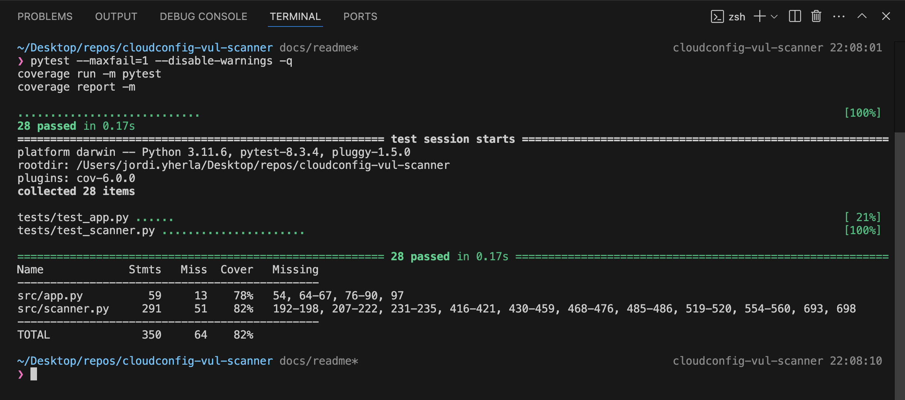

# Cloud Config Vulnerability Scanner

## Code Status
[](https://github.com/yherla/cloudconfig-vul-scanner/blob/main/.github/workflows/build.yml)

[](https://sonarcloud.io/summary/new_code?id=yherla_cloudconfig-vul-scanner)

[](https://sonarcloud.io/summary/new_code?id=yherla_cloudconfig-vul-scanner)
[](https://sonarcloud.io/summary/new_code?id=yherla_cloudconfig-vul-scanner)

[](https://sonarcloud.io/summary/new_code?id=yherla_cloudconfig-vul-scanner)
[](https://sonarcloud.io/summary/new_code?id=yherla_cloudconfig-vul-scanner)
[](https://sonarcloud.io/summary/new_code?id=yherla_cloudconfig-vul-scanner)

[](https://sonarcloud.io/summary/new_code?id=yherla_cloudconfig-vul-scanner)
[](https://sonarcloud.io/summary/new_code?id=yherla_cloudconfig-vul-scanner)
[](https://sonarcloud.io/summary/new_code?id=yherla_cloudconfig-vul-scanner)

[](https://sonarcloud.io/summary/new_code?id=yherla_cloudconfig-vul-scanner)
[](https://sonarcloud.io/summary/new_code?id=yherla_cloudconfig-vul-scanner)
[](https://sonarcloud.io/summary/new_code?id=yherla_cloudconfig-vul-scanner)

## Introduction
This project is a lightweight, serverless web application designed to scan JSON configuration files for potential security vulnerabilities. The security checks are based on recognized industry standards, specifically the [CIS Benchmarks](https://www.cisecurity.org/cis-benchmarks), and best practices across multiple cloud providers (GCP, AWS, Azure), as well as Knative services. The application is suitable for deployment on the Google Cloud Platform (GCP) Free Tier with trial and is optimized for quick setup and minimal maintenance.

**Highlights:**
- Serverless architecture on **Google Cloud Run**.
- Scans for security issues in JSON configuration files (e.g., open ports, missing encryption, overly permissive roles, etc.).
- Generates a report with remediation steps.
- Includes a rate limiting workaround (via **Flask-Limiter**) and CSRF protection (via **Flask-WTF**).
- Test coverage and code quality checks with **SonarQube Cloud**.

---

## Features

1. **Upload and Scan**: Users can upload a JSON configuration file. The backend parses and scans it for security vulnerabilities.
2. **Multiple Cloud Providers**: Supports detection of common issues in GCP, AWS, Azure, and Knative resource configurations.
3. **Detailed Report**: Generates a vulnerability report listing each issue, severity, and recommended remediation.
4. **Export to CSV**: Users can download a CSV version of the vulnerability report.
5. **Basic Security Controls**:
   - **CSRF Protection** using **Flask-WTF**.
   - **Rate Limiting** using **Flask-Limiter** to protect against excessive or malicious requests.
   - **Container Scanning** using **Artifact Analysis**.
6. **Unit Tests & Coverage**: Comprehensive tests with **pytest** and coverage reporting.

### Vulnerabilities Covered

| Type                           | Description                                                                                                           | Typical Severity | Remediation                                                                                                                            |
|--------------------------------|-----------------------------------------------------------------------------------------------------------------------|------------------|---------------------------------------------------------------------------------------------------------------------------------------|
| **SensitiveInformationExposure** | Detects credentials, tokens, or secrets in plain text.                                                               | High             | Use encryption or a secret manager to store sensitive data; do not use plain text values.                                             |
| **DebugModeEnabled**           | Flags when a “debug” flag is left true in production.                                                                 | Medium           | Disable debug mode in production to prevent exposure of internal details.                                                            |
| **InsecureConfiguration**      | Checks for insecure flags like `use_eval`, `allow_root_login`, or other unsafe defaults.                              | High/Medium      | Review and disable insecure options (e.g., eval, dynamic loading, root login).                                                        |
| **EncryptionDisabled**         | Ensures that encryption is enabled for cloud resources (storage, disks, RDS, etc.).                                   | High             | Enable encryption to protect data at rest.                                                                                            |
| **MFADisabled**                | Flags MFA not enabled for accounts or resources requiring multi-factor authentication.                                | Medium           | Enable MFA to secure access.                                                                                                          |
| **WeakPassword**               | Detects passwords that are too short or match common patterns like “weak”.                                            | High             | Use a stronger password or integrate with a secrets management system.                                                                |
| **OpenPortExposure**           | Flags sensitive ports (e.g., 22, 3389) accessible to the internet.                                                    | Medium           | Restrict access to open ports using firewalls or security groups.                                                                     |
| **PrivilegedContainer**        | Detects containers running in privileged mode.                                                                        | High             | Avoid running containers in privileged mode; run with least privileges.                                                               |
| **PublicAccessEnabled**        | Identifies resources (e.g., S3 buckets, Azure storage, GCP BigQuery datasets) with public access.                     | High             | Restrict public access by applying proper access controls and encryption.                                                            |
| **OverlyPermissiveIAMRole**    | Flags IAM roles or policies granting wildcard (“*”) actions or roles/owner to all users.                              | High             | Limit permissions to only what is strictly necessary.                                                                                 |
| **WideOpenSecurityGroup**      | Security groups/firewall rules allowing 0.0.0.0/0 inbound/outbound traffic.                                           | High             | Restrict inbound/outbound traffic to specific IP ranges.                                                                              |
| **IAMPolicyOverlyPermissive**  | Flags policies that grant overly broad IAM permissions.                                                               | High             | Review and tighten IAM policy bindings.                                                                                               |
| **CloudFrontInsecure**         | Detects CloudFront distributions not enforcing HTTPS.                                                                 | Medium           | Configure CloudFront to enforce HTTPS.                                                                                                |
| **OSLoginDisabled**            | GCP: OS Login not enabled on compute instances.                                                                       | Medium           | Enable OS Login on compute instances for better security.                                                                             |
| **ShieldedVMDisabled**         | GCP: Shielded VM not enabled.                                                                                        | Medium           | Enable Shielded VM features.                                                                                                          |
| **SerialPortDebugEnabled**     | GCP: Serial port debugging enabled.                                                                                   | Medium           | Disable serial port debugging in production.                                                                                         |
| **LoggingMonitoringDisabled**  | GCP: Cloud Logging or Monitoring is disabled.                                                                         | Medium           | Enable logging and monitoring for better observability.                                                                               |
| **LegacyABACEnabled**          | GCP: Container cluster with legacy ABAC enabled.                                                                      | High             | Disable legacy ABAC; enable RBAC and network policies on container clusters.                                                          |
| **NoKeyRotation**              | KMS keys missing rotation policy.                                                                                    | Medium           | Enable key rotation to improve key security.                                                                                          |
| **CloudTrailMisconfigured**    | AWS: CloudTrail missing multi-region or log validation, or is unencrypted.                                           | Medium/High      | Enable multi-region trails, log file validation, and encryption for CloudTrail.                                                       |
| **RunAsRoot**                  | Detects containers running as root (UID 0).                                                                           | High             | Avoid running containers as root; set a non-root UID.                                                                                 |
| **LatestTagUsed**              | Flags containers pulling the `:latest` image tag.                                                                     | Medium           | Pin specific versions of container images rather than using `:latest`.                                                                |
| **MissingResourceLimits**      | Container does not define CPU/Memory resource limits.                                                                 | Medium           | Set container resource limits (CPU/Memory).                                                                                           |
| **MissingReadOnlyRootFilesystem** | Container filesystem is not read-only.                                                                                | Medium           | Enable `readOnlyRootFilesystem` in container `securityContext`.                                                                       |

### Currently Supported Providers & Resource Types

- **AWS**: `ec2_instance`, `s3_bucket`, `iam_role`, `rds_instance`, `security_group`, `cloudtrail`, `kms_key`, `iam_user`, `lambda_function`, `cloudfront_distribution`, `cloud_config`.
- **Azure**: `storage_account`, `key_vault`, `virtual_machine`.
- **GCP**: `compute_instance`, `firewall_rule`, `cloud_logging`, `cloud_monitoring`, `container_cluster`, `iam_policy`, `cloud_sql`, `bigquery_dataset`, `dns_managed_zone`.
- **Knative**: `Service` objects (`apiVersion` starting with `serving.knative.dev/`).

---

## Demo

Below are a few screenshots demonstrating the application in action:

1. **Homepage & File Upload**

   The main page where JSON files can be uploaded for scanning.

   
   
2. **Upload Page**  

   The page displayed once the file is uploaded. It lists the findings of the scan, allows the user to download the .csv report and to go back to the Homepage.

   

3. **Generated Report**

   Example of a vulnerability report generated by the app, showing identified issues and remediation steps (dummy-sample-input-json-files/gcp2.json used for this example).

   

---

## Technology Stack

- **Python 3.9**
- **Flask** (web framework)
- **Flask-WTF** for CSRF protection
- **Flask-Limiter** for rate limiting incoming requests
- **Docker** for containerization
- **Google Cloud Run** for serverless deployment on GCP free trial
- **pytest** for unit testing
- **coverage** for test coverage reporting
- **SonarCloud** for code quality and security scanning

---

## Design

We employ a minimalistic **two-layer** design for simplicity and maintainability:

   **Presentation Layer (Flask Application)**: Handles HTTP routes, file uploads, rendering templates, and basic request validations as well as security controls.

   **Logic Layer (Scanner)**: Encapsulates all vulnerability checks and remediation recommendations. Processes uploaded JSON configurations and returns structured vulnerability data.  

### Class Diagram (Key Components)


### Cloud Run Deployment Diagram


---

## Setup and Installation for Deploying to Google Cloud Run

Having a Google Cloud account is required. To use the following GCP services, it is necessary to have at least a Free Tier with trial.

0. **(Optional) Enable Vulnerability Scanning in Artifact Registry**:
   By enabling the Container Scanning API, Artifact Analysis automatically scans each newly pushed image to Artifact Registry in that project.
   ```bash
   gcloud services enable containeranalysis.googleapis.com
   ```

   For further details on this option, go to the "Security Checks Implemented" section below.

1. **Clone the Repository**  
   ```bash
   git clone https://github.com/<your-username>/cloudconfig-vul-scanner.git
   cd cloudconfig-vul-scanner
   ```

2. **Install and Configure gcloud**  
   - [Install the Google Cloud CLI](https://cloud.google.com/sdk/docs/install).  
   - Initialize and set your project (replace `YOUR_GCP_PROJECT_ID` with your own):
     ```bash
     gcloud init
     gcloud config set project YOUR_GCP_PROJECT_ID
     ```

3. **Deploy the Application**  
   
   ```bash
   gcloud run deploy --source .
   ```
   - Select a name (if empty will be named cloudconfig-vul-scanner by default) and region, for europe it recommended using `[16] europe-west1`.
   - Choose whether to allow unauthenticated invocations. Important: If unauthenticated access is enabled, be aware that on the GCP free trial, the app cannot be protected with Load Balancer or Cloud Armor policies unless a Google Cloud Domain is purchased.
   - Google Cloud Run will use the Dockerfile to build the container image. The container image will be stored in Google Artifact Registry (GAR).

   

4. **Access the Application**  
   After deployment, it will display a service URL like:  
   **https://cloudconfig-vul-scanner-12345678987.europe-west1.run.app/**  
   Open the URL in a browser to upload and scan JSON configurations.

   

   - CAUTION: To delete the service, use `gcloud run services delete cloudconfig-vul-scanner --region=europe-west1` (assuming that the service name is cloudconfig-vul-scanner and the region is europe-west1) 

---

## Setup and Installation for Running the Application Locally

1. **Clone the Repository**  
   ```bash
   git clone https://github.com/<your-username>/cloudconfig-vul-scanner.git
   cd cloudconfig-vul-scanner
   ```

2. **Set up a Local Python Environment**  
   - Make sure you have **Python 3.9+** installed.  
   - Create and activate a virtual environment:
     ```bash
     python -m venv venv
     source venv/bin/activate   #venv\Scripts\activate on windows
     ```

   - Install Python dependencies:
     ```bash
     pip install -r requirements.txt
     ```

3. **Run the Flask App**  
   ```bash
   python -m src.app
   ```  
   The application listens on `http://0.0.0.0:8080` by default.
   Visit [http://localhost:8080](http://localhost:8080) in a browser to see the upload interface.

   

   

4. **Run Tests & Coverage**  
   ```bash
   #run tests
   pytest --maxfail=1 --disable-warnings -q

   #generate coverage report
   coverage run -m pytest
   coverage report -m
   ```  
   Check the `coverage` folder for detailed test coverage reports.

   

---

## Security Checks Implemented

- **(Optional) Enable Vulnerability Scanning in Artifact Registry**: By enabling the Container Scanning API, Artifact Analysis will automatically scan every new container image pushed to Artifact Registry within your project.

If you already enabled it, see the scan results for images pushed after the activation by navigating to the Artifact Registry console:


The Vulnerability Scan Results can be accessed from the panel, which display all detected vulnerabilities, categorized by CVE (Common Vulnerabilities and Exposures) identifiers:


Select any of the vulnerabilities listed for further details and suggestions.

- **CSRF Protection**: Uses **Flask-WTF** to include a CSRF token in every form submission, preventing cross-site request forgery.

- **Rate Limiting**: As a workaround to the incapacity of using Load Balancers and Cloud Armor policies to manage inbound traffic to our service, **Flask-Limiter** is configured at application-level to allow a maximum of **20 requests per minute**. 

While this does not entirely prevent brute-force attacks or DoS attempts from a single source when unauthenticated invocations are allowed, it can reduce their impact by limiting processing overhead and preventing excessive load on the application. Additionally, the enforced rate limit may discourage automated attacks, as repeated failures or delayed responses could make them appear ineffective, prompting attackers to abandon their attempts.


It is important to note that this rate limiter uses "memory://" as its storage backend, meaning it tracks request limits locally within the instance. That works for a single-instance deployment, but in a multi-instance setup, each instance would track requests independently, making rate limits inconsistent. 

- **Static Code Analysis**: With **SonarCloud** for code quality/security gate.

- **Test Coverage**: Ensures baseline code coverage to detect regressions or vulnerabilities introduced by new code.

---

## Limitations and Future Improvements

1. **Free Tier Constraints**:
   - Using Cloud Run on a free tier means we cannot easily set up a custom domain or advanced networking (e.g., global load balancing with Cloud Armor).
   - Relying solely on the randomly generated `.run.app` domain and built-in Cloud Run security measures prevents us from restricting inbound traffic.

2. **No Integration with Cloud Armor**:
   - Because of the free tier and domain restrictions, we cannot attach a global load balancer for advanced WAF (Web Application Firewall) capabilities.
   - Rate limiting is handled at the Flask application level rather than at the perimeter.

3. **Limited Resource and Vuls Coverage**:
   - Although multiple providers and resources are supported, the scanner does not yet cover every service or scenario. It focuses on a subset of high-impact checks.
   - Future expansions could include more AWS, GCP, and Azure services (e.g., EKS, AKS, advanced GKE checks).
   - More vulnerability types could be added too.

4. **CI/CD Enhancements**:
   - Future improvements might include a GitHub Action workflow using [google-github-actions/deploy-cloudrun](https://github.com/google-github-actions/deploy-cloudrun) to automatically test, build, and deploy from GitHub.

5. **Extensibility**:
   - Additional checks for container best practices, more nuanced IAM role validations, or real-time scanning of ephemeral configurations could be added.

---

## License
This project is licensed under the [MIT License](LICENSE).

---